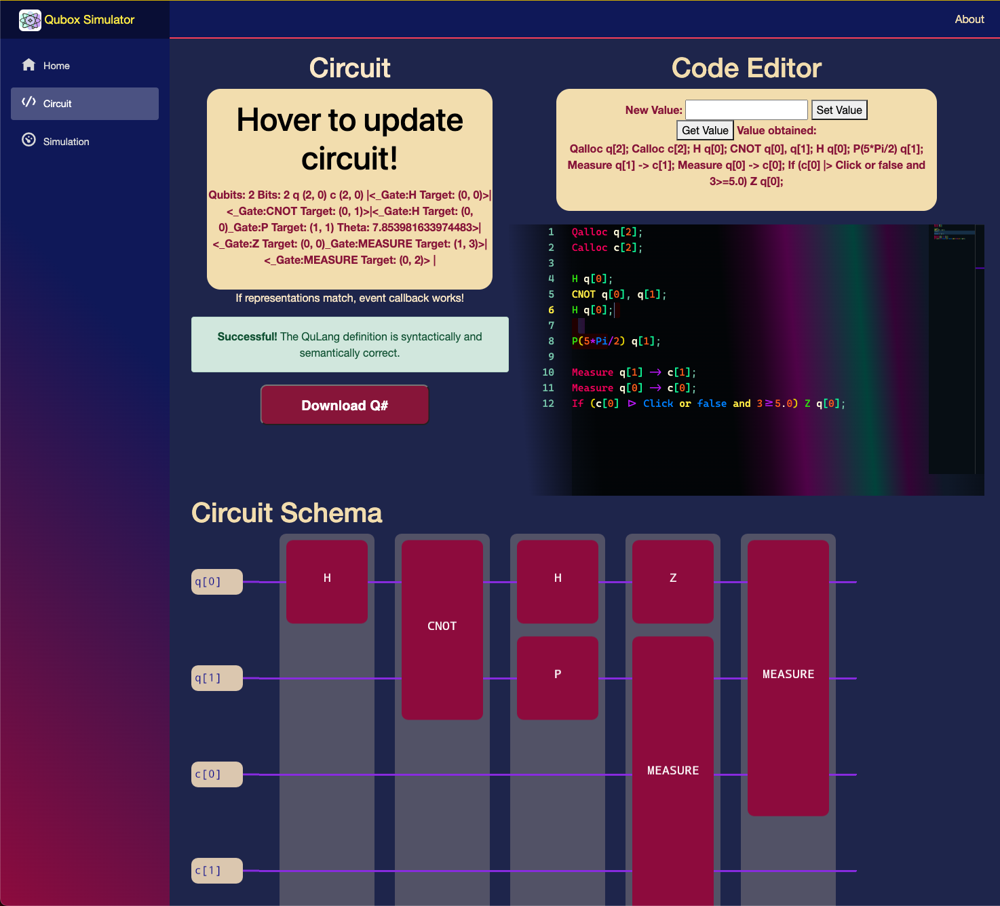

# ⎨💠 Welcome to QuBox™! 💠⎬ 

Quantum computing is a rapidly-emerging technological field at the junction of computer science and quantum mechanics. The topic aims to revolutionize research relying on heavy computation and leverage some of the physical limitations of classical supercomputers. The revised computation model stores and manipulates information on `qubits`, as  a replacement for classical binary bits that are intrinsically part of the devices we use today.

The study of quantum computing attempts to outperform the capabilities of classical supercomputers in solving specific classes of problems that can encode helpful information in the underlying computation model. Conceptual examples extend beyond universal Turing computation to Quantum Key Distribution (QKD) and Quantum Machine Learning (QML), with an exciting application of Shor’s algorithm for efficient factorization. Therefore, it should be noted that quantum computers are not universally faster than their classical counterparts. The performance advantage would then come from an exponentially smaller number of operations needed to achieve the result, rather than the execution time of each procedure.

# Quick Links:
| [Quantum Information](#quantum-information) | 
[Objectives](#objectives) | 
[Architecture](#platform-architecture) |
[QuLang Processor](#quantum-definition-language) | 
[QuBox Engine](#qubox-engine) |
[Blazor Web-GUI](#blazor-web-gui) |
[Evaluation](#evaluation) |
[Conclusion](#conclusion) |

# Quantum Information:

The possibility of performing a large number of operations in parallel (quantum parallelism), is established on 2 fundamental properties of quantum states: superposition and entanglement. The basic unit of quantum information is the `qubit` that can exist in multiple intermediate states as linear superpositions of basis states — 0 and 1.  Entanglement means in essence that under some circumstances 2 units can form a single entity and any attempt to view or separate the entity into a combination of the 2 units fails by breaking that internal correlation. Thus, the state of one entity affects the state of the other.

Quantum computing relies on the computation model of uniform reversible circuits, which is equivalent to the universal Turing machine and is expressed in terms of a series of matrix-vector multiplications. Any irreversible computation can be made reversible by adding additional qubit channels if needed. Reversible operations are implied by a quantum computing principle that assures the evolution of a quantum system is unitary. Most quantum operators are considered their own inverses and referred to as involutory matrices. 

The vector representation of a qubit is given below:
```math
  \ket{\theta} = \cos \theta \ket{0} + \sin \theta \ket{1}, \text{~where~} \ket{0}=\begin{pmatrix} 1 \\ 0 \end{pmatrix}, \ket{1}=\begin{pmatrix} 0 \\ 1 \end{pmatrix}
```
Multiple qubits can be combined into a single entity by use of the `tensor product` - similar to the `Kronecker product`:
```math
  \ket{\alpha} \otimes \ket{\beta} = \ket{\alpha \beta}
```
The state-vector size of such systems grows exponentially with the number of qubits included $dim(\mathcal{H})=2^{n}$.
Quantum operators (gates) are physical devices that perform gentle touches to the state of the qubit, without collapsing it. The `Hadamard` gate allows the transition from a classical bit (base state) to one in perfectly equal superposition and the other way around without the need for measurement. The `X` gate is similar to the negation (bit-flip) operation performed on classical bits and belongs to the family of `Pauli` gates. The analogous operation to the `NAND` used in modern computers is the `CNOT` (control-not). Whenever the control bit is `1` a bit-flip operation is triggered on the target bit, otherwise remaining unchanged. Although, when the control bit is in perfect superposition we obtain the special effect of `quantum entanglement` between 2 qubits. It is a form of intrinsic correlation that has no limit in space and time. It does not allow us to factorize the state of a quantum system into separate qubit states and any measurement collapse on one of the involved qubits inflicts a change in the state of the other qubit. Einstein referred to this phenomenon as a `Spooky action at a distance`.

# Objectives:

The development of quantum computing is for now stuck in the era of the noisy intermediate-scale quantum (NISQ) paradigm. The primary ambition for the future post-NISQ era is to develop a fault-tolerant scalable quantum device, able to resemble the universal quantum machine - run any quantum algorithms and correct errors faster than the rate at which they occur. This expectation is based on the principle of quantum error correction, which essentially implies that in order to protect the quantum system from environmental damage, encoding it in a very highly entangled state is necessary. 

Real quantum machines are not readily available at all times due to high operational costs and limited resources, hence hardware providers impose various cloud runtimes to maintain the efficient scheduling of quantum jobs. Quantum composers however allow prompt executions of quantum algorithms on classical computers, with an exponentially increasing complexity - reducing the number of qubits modelled in the system. Despite the limitations, such simulators prove beneficial in alleviating the cost and complexity of developing and testing low-scale circuits.

In the modern context of the field, there is a considerable need for web platforms where users can design and test out quantum circuits. With these kinds of tools, researchers can quickly iterate and improve designs for developing algorithms, protocols and circuits, ultimately leading to faster progress in the field. With supportive interfaces, the accessibility of the research topic is broadened to a wider audience, abstracting away some of the underlying sophistication.

The primary objective of the platform we are providing is to remove the complexities associated with working in a high-level quantum framework and provide a static client-side solution that can run in the web browser at any given time - online or locally. The open-source projects will ensure a straightforward extension of the platform with new functionality using a modular and patterned structure.

# Platform Architecture:

The overall architecture of the platform is divided into 3 main projects with associated testing projects, each bundling related logic into tighter scopes. The end-user will interact directly with one of the projects that builds a web-based client-side application as the graphical user interface `GUI`. The `QuLangProcessor` project comprehends the entire logic of `QuLang` language processing (parsing, compilation and optimization). In the `QuBoxEngine`, the circuit modelling is encoded and an ideal state-vector simulator is built. The latter two projects are packaged independently and have corresponding `API` handlers to provide access to the required platform logic.

 

As illustrated in the figure, the interface project does not directly interact with the language processor. Instead, the interpreter module mediates the user's input text to the `QuLang` processor, which compiles the abstract syntax tree. Subsequently, the interpreter communicates with the package it belongs to, retrieving the compiled circuit to provide it back to the interface in response. Therefore, the `GUI` project does not require extensive knowledge of the language's syntax tree or other implementation details of the processor. The simulator and modelling logic can be substituted with reliance on the language processor using its `API` calls. <br></br><br></br>

# Quantum Definition Language:

To establish a well-defined syntax for declaring the circuits, a lightweight domain-specific language `DSL` called `QuLang`, replicating the role of `OpenQASM` in the `Qiskit` framework to the `.NET` environment. This language will enable users to allocate quantum and classical registers, define arithmetic and logical variables, and apply quantum gates on one or multiple qubits.

We used `BNF` grammars to declare the syntax of the language and automatically generate the `Lexer` and `Parser` units of the compiler. The structural units of the language in the form of an abstract syntax tree are defined in the [AST.fs](QuLangProcessor/AST.fs) file, from which further analysis and processing would be implemented more easily. Every grammar production corresponds to the construction of specific AST types (see [Parser.fsy](QuLangProcessor/Parser.fsy) ). For this, we took use of disjoint cases and pattern-matching in the functional programming paradigm. Within the expressions, we grouped statements based on the type of effect they have, in order to provide a modular structure that can be easily extended with additional features. Sub-trees of different kinds of expressions can intermix in the general `Circuit` AST type. The latter is formed out of an `Allocation` structure and a `Schema` that manifests as a list of `Statements`. 

Before any circuit definition is interpreted by the engine, we perform a syntactical and semantic analysis to ensure the provided input is indeed meaningful and precise. Further on, to facilitate the traversal of the syntax tree from top to bottom, we applied expression reduction rules (mathematical identities and properties of operators) to optimize the structure of the `AST`. This functionality is incorporated within the `Compiler` module that performs an implicit type checking to verify that parsing results in structures belonging to the correct AST unit/type - automatic generalization and type inference.

The back-compiler unit in the package architecture is responsible for generating prettified `QuLang` syntax out of a provided `AST`. This transition could be used to update the textual content in the web editor according to whatever changes the user performs on the graphical representation of the circuit.

 

In a similar fashion, we provide a conversion of the `AST` structure to correctly compiling `Q#` code. The string generated is wrapped within an operation structure with the required namespaces and imports, with potential storage in a file. Eventually, such a file can be used to define a quantum job on real `NISQ` machines through the infrastructure provided by Azure Quantum.

The architecture of the QuLang Processor and transitions between modules are displayed in the figure. The logic of the entire package is encapsulated behind a front-facing interface that can resolve different requests related to the processing of QuLang code — with the use of the Facade Design Pattern. The simplified API abstracts away the complexity of processing and improves the usability of the package with according input validation.

# QuBox Engine
## Modelling
In the engine, we have modelled the state of the quantum system and assembled a hierarchical organization of quantum gates placed on the circuit grid. The placement of gates is determined by specific guidelines such that the unitary evolution principle is not violated within our replica of the quantum system. The green-coloured interfaces in the hierarchy are the only entities accessed outside the namespace. All the red concretions are hidden from potential clients. The construction of gates is delegated to a `GateFactory` entity that provides multiple overridden methods to easily create classes of gates based on the information at hand. 

 

In order to retrieve this information from the AST assembled by the `QuLang Processor`, we implemented a `Visitor` unit. It relies on the support offered by interfaces `IVisitable` and `IVisitor` in the AST block of the first project. The decoupled `Visitor` generates a correctly formed `Circuit` based on the AST obtained through the API request. 

To facilitate a possible `Circuit` execution, it is important to model the columns of gates applied as an execution step. These structures, called `Towers` have the height determined by the number of bits in the system and consist of a list of gates arranged from top wire to bottom wire. Whenever a `Tower` object is constructed the list includes a `NoneGate` on every wire as a placeholder. A `Tower` is considered empty if it only consists of placeholders.

The last piece in the language-related transitions was the unit that deconstructs the circuit object back into the appropriate AST structure, which could be useful when having multiple access points for modification of the constructed `Circuit`. This way we can always synchronise the QuLang representation of the circuit and the visualisation in a possible drag-and-drop interface.

Using the principles of clean code and `Facade` pattern, we bundled the entire logic under the scope of an `Interpreter` that handles calls for various functionalities. As part of the package, we provided a unit that uses high-performance image rendering to provide an SVG figure of the constructed circuit with the possibility of displaying it on the interface or saving it into a file.

In order to complete the loop of language-related transitions we implemented a unit that deconstructs the circuit object back into the appropriate AST structure, which could be useful when having multiple access points for modification of the constructed Circuit. This way we can always synchronise the `QuLang` representation of the circuit and the visualisation in a possible drag-and-drop interface.

## Simulation
The simulation of circuits and the modelling of the quantum state in the system is performed separately in concordance with the measurement postulate and other properties explained in the background. This way we maintain a state vector of exponential size with regards to the number of qubits in the system. In each step of the circuit execution, we take a column of gates, construct their tensor product and apply the obtained operator to the state vector. This process is repeated until all Towers have been processed. Upon a measurement command, we compute the probability of the target qubit to be in state $\ket{0} $ or $\ket{1} $ respectively and update the measurement space of classical bits with the found recordings.

# Blazor Web-GUI:
The Blazor WebAssembly framework allowed us to make the interface client-side and host it easily as a static page that relies on no data server and is accessible at all times. All the functionality is assembled into compact web resources used by the browser to build up the application and manipulate the Document Object Model of the page. using the `WebAssembly` standard. The app is available through the GitHub Pages environment we have set up to host the static page.

The general pattern of the app is a Single-Page Application `SPA`, that allows updating the content of the web document according to new data being processed or user actions on the interface. In order to persist the state of the application from tab to tab, we have declared a StateContainer that contains the Circuit object on which we perform transformations or simulations. Whenever the Circuit object is changed we notify the event callback, such that components can update or even re-render based on the new information.

## Circuit Designer Page
This page injects a StateContainer object to keep track of the built circuit and pass it to the simulator when needed. We provide an IDE-like editor for the input of `QuLang` definitions designed around our syntactical units to support syntax highlighting and auto-complete suggestions. Therefore, a `Monaco` text editor has been integrated into the project using the open-source `BlazorMonaco` package. Whenever the user changes the content of the editor panel or goes out of focus, the content of `Monaco` is sent to the parent components to update the page accordingly. Once the user is ready with the definition, the circuit object can be updated by hovering over one of the cards aside. According to the validity of the format, an alert will pop up to denote whether the analysis is successful or if there exists a specific kind of error. 

Besides, an animated download button allows the user to create and retrieve a Q# code file containing the translated version of the constructed circuit. This can be further used on `Azure Quantum` to schedule execution jobs. Below, the editor we have set up a panel for `SVG` visualisations representing the structure of the quantum circuit having gates assigned to specific qubit wires. The content of the figure is constructed by the `SVGProvider` unit in the `QuBox Engine`.



## Simulation Page
Similar to the `CircuitDesigner` Razor page we will link this page to the injected `StateContainer` with the use of `OnInitialized()` and `Dispose()` methods defined for the life cycle of each component. Initially, before triggering the simulation of the circuit by hovering over the card, we provide a loading animation. Once the user hovers the mouse over the trigger card, we bind the action to a method called `SimCircuit()` that takes care of the logic to execute a simulation. The `Circuit` definition is extracted from the `StateContainer` and then passed to a new `Simulator` instance if the definition is available. Subsequently, we trigger the simulation by calling `simulator.Run()` and store the `State` object in the private variable. Once these results become available, they are displayed on the screen in two columns: first, the probability amplitudes of each component in the state vector after the execution and second, the probability of each outcome in the measurement space.

# Evaluation

One of the first things we decided to achieve within the platform was a simplified quantum language that allows the user to declare circuits in an intuitive experience. The `QuLang` format we created has the same role for the `Q#` language as `OpenQASM` language in the Qiskit framework. Similarly, the size of the expression parse trees gets significantly reduced using the reduction rules within the compiler. 

To assess the performance of the simulator we have selected a set of common circuits as a test base and compared our results to the ones obtained on the IBM Quantum Composer platform. Compared to the other platform, our solution is not yet capable of correctly modelling the measurement of entangled states and including the error of physical devices in the probability distribution. However, all other functionalities and the extended set of quantum gates were validated. 

To demonstrate the workflow of designing and simulating circuits on the web interface, we tried a study case on a Bell inequality, commonly part of quantum key distribution protocols. The CHSH operator is used to validate that 2 parties share a perfectly entangled state and that there’s no eavesdropping attack occurring on the communication channel. Using the results obtained we confirmed that all the theoretical implications apply in our quantum model. We also performed a comparison between the correlation coefficient found on our platform and the one resulting from a real NISQ machine execution.

 

Similarly, to verify the correctness and preciseness of our modular packages we have implemented a wide collection of unit test cases to validate the functionality of independent modules and integration tests to verify how different entities of the platform interact with each other achieving the common goals. By testing out all production rules in the grammar we ensured that the syntax of the circuit definition is precise, doesn’t allow illegal statements and is deterministic by removal of ambiguity. The integration between the API `Handler` in the first package and the `Interpreter` orchestrating the construction of the circuit object, was tested with a variety of input cases.

The continuous integration/deployment workflows helped us maintain a working solution at all times and re-iterate the development of the platform based on changes emerging along the way. Using the above we have also performed a coverage analysis that achieved 98% of the code within the packages. 


# Conclusion
The study proposed an enhancement to the accessibility of quantum computing simulators and circuit design tools. The primary focus of our work has been to develop a simplified quantum language and a corresponding quantum circuit modelling tool. Additionally, we have created a browser-based graphical user interface that functions as a client-side application, eliminating the need for internet connectivity or server communication. Furthermore, we have implemented a state-vector simulator capable of providing the output of the unitary state evolution based on the constructed circuit.

These effective tools serve as an open-source alternative to IBM's Quantum Composer, addressing the lack of such options within the .NET environment. With further advancements, our platform could evolve into a design sandbox integrated with Microsoft's infrastructure. This would facilitate the study of emerging quantum algorithms and enable efficient resource utilization on NISQ machines whenever possible.
